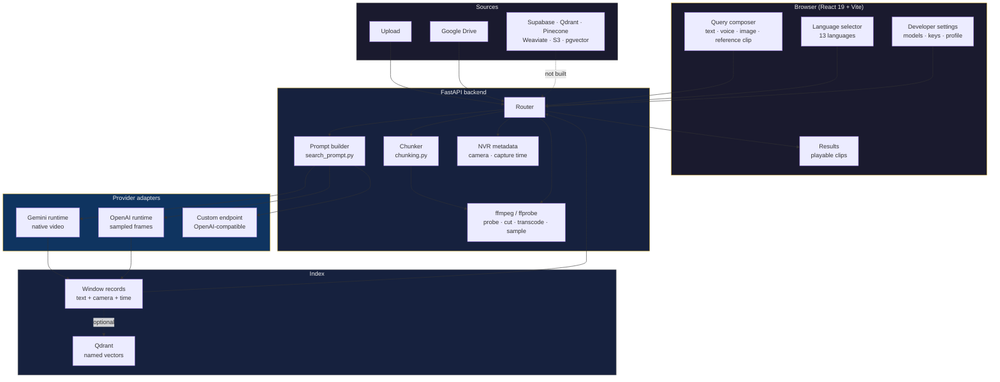
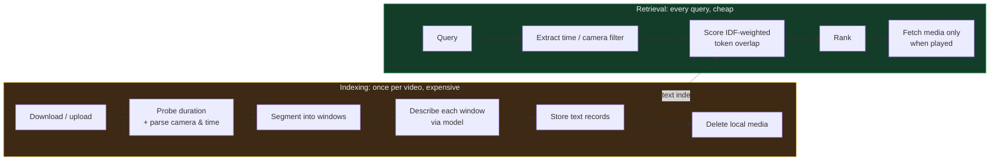

# System Architecture

Mermaid renders natively on GitHub, so these diagrams stay readable in the
repository and in any Markdown viewer without an image pipeline.

## Complete system

## Why the two paths are asymmetric

Indexing is expensive and runs once per video. Retrieval is cheap and runs
constantly. Separating them is the central design decision: it is what lets a
library of hundreds of videos answer a query in microseconds while costing
kilobytes of storage.

