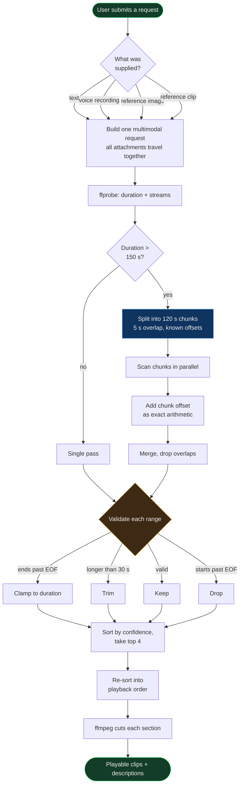
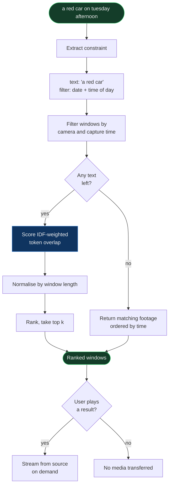
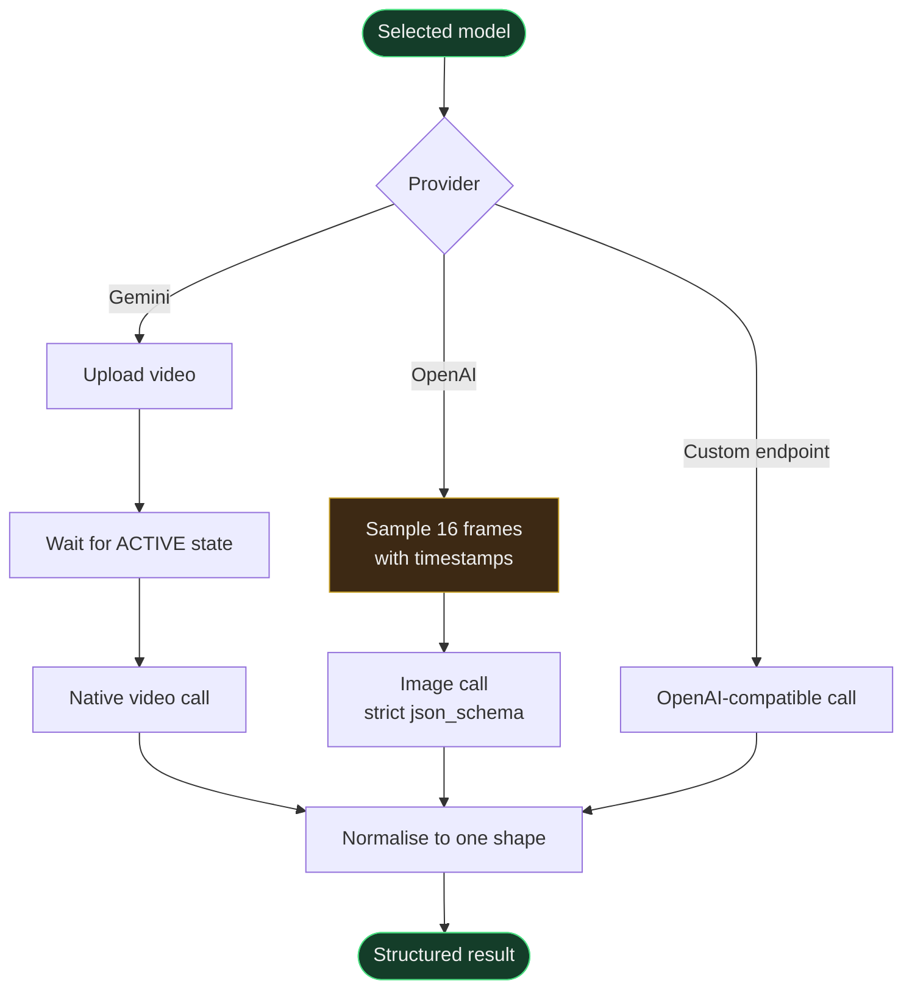

# Control Flow

## Query: from a sentence to a playable clip

The validation branch exists because a model's sense of elapsed time drifts on
long footage. It once placed an event at 200 s that actually occurs at 414 s,
and the clip cut from that timestamp showed the wrong footage. Chunking removes
the cause; validation catches whatever survives.

## Library search: no model in the path

Time words are removed from the text before scoring. Leaving them in would have
the literal matcher rank a window for containing the word "afternoon".

## Provider selection

The ACTIVE wait is not optional. An uploaded video is not immediately usable,
and calling too early fails with `FAILED_PRECONDITION` intermittently, which
looks like a flaky network rather than a race.

OpenAI models cannot accept video, so that path samples frames and reports
`frames_sampled` in the response rather than implying the model watched the
file.
