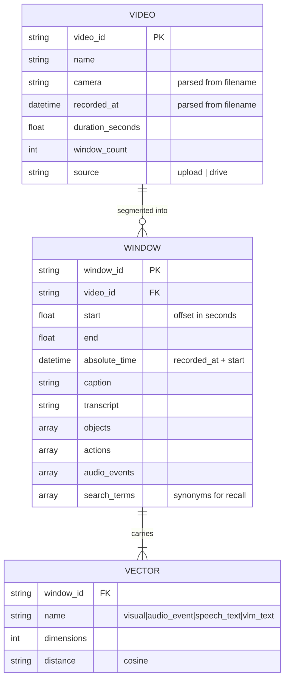
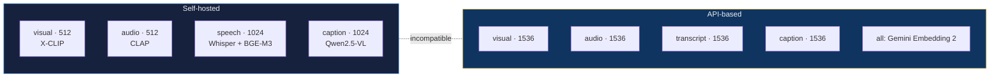
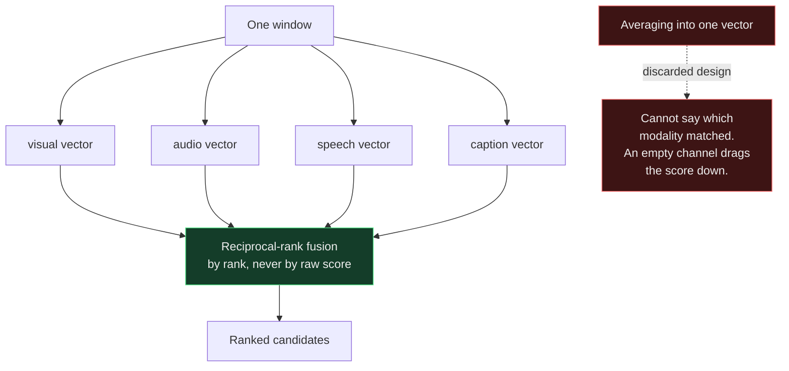

# Data Model

## Entities

## Vector contract per profile

The dimensions differ between profiles, which is why an index built under one
cannot be searched under the other. The UI states this rather than letting
someone discover it through bad results.

## Why modalities stay separate

This is what makes a silent video searchable. With no audio track, the audio and
speech channels contribute no rank at all, rather than contributing a zero score
that would push genuine visual matches down the ranking.

## Normalisation

Third normal form on the relational side: a window carries no video-level
attribute, so a video renamed once is renamed everywhere.

The repeated groups (`objects`, `actions`, `audio_events`, `search_terms`) are a
deliberate exception. They are denormalised into arrays because they are always
read as a unit with their window and never queried independently, so a join
table would add cost without buying anything.
