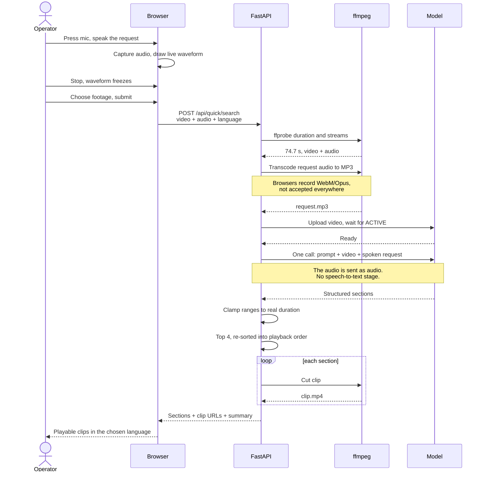
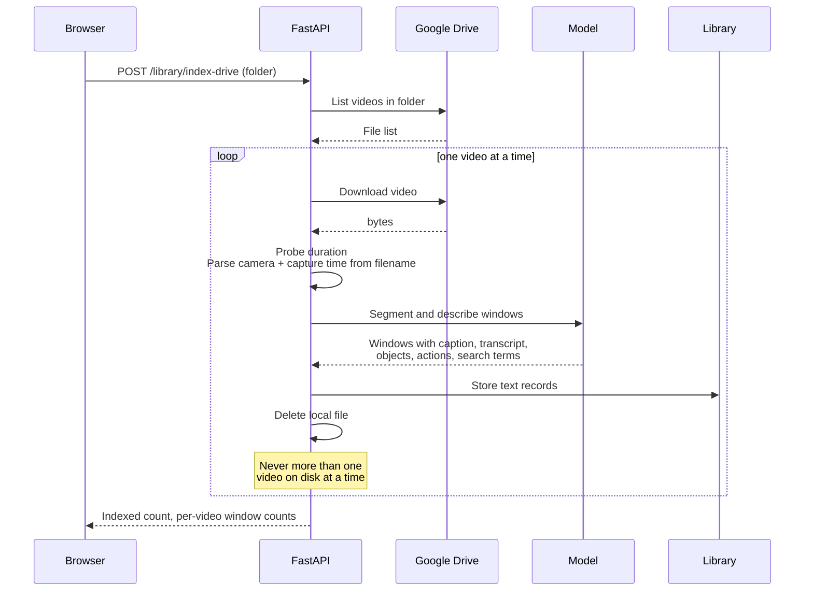
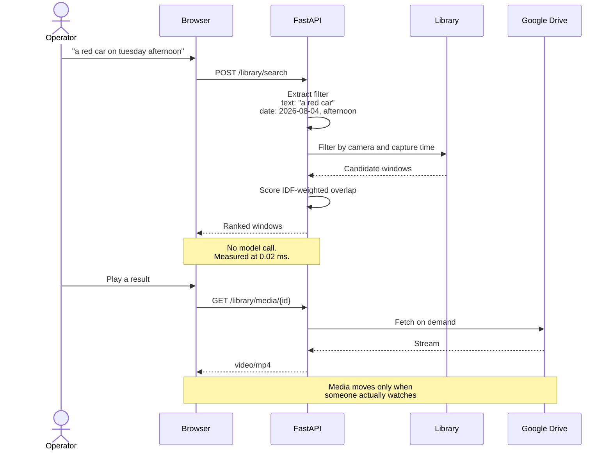

# Sequence Diagrams

## Query with a spoken request

```mermaid
sequenceDiagram
    actor U as Operator
    participant UI as Browser
    participant API as FastAPI
    participant FF as ffmpeg
    participant M as Model

    U->>UI: Press mic, speak the request
    UI->>UI: Capture audio, draw live waveform
    U->>UI: Stop, waveform freezes
    U->>UI: Choose footage, submit

    UI->>API: POST /api/quick/search<br/>video + audio + language
    API->>FF: ffprobe duration and streams
    FF-->>API: 74.7 s, video + audio
    API->>FF: Transcode request audio to MP3
    Note over API,FF: Browsers record WebM/Opus,<br/>not accepted everywhere
    FF-->>API: request.mp3

    API->>M: Upload video, wait for ACTIVE
    M-->>API: Ready
    API->>M: One call: prompt + video + spoken request
    Note over API,M: The audio is sent as audio.<br/>No speech-to-text stage.
    M-->>API: Structured sections

    API->>API: Clamp ranges to real duration
    API->>API: Top 4, re-sorted into playback order
    loop each section
        API->>FF: Cut clip
        FF-->>API: clip.mp4
    end
    API-->>UI: Sections + clip URLs + summary
    UI-->>U: Playable clips in the chosen language
```

## Indexing a Drive folder

```mermaid
sequenceDiagram
    participant UI as Browser
    participant API as FastAPI
    participant DR as Google Drive
    participant M as Model
    participant LIB as Library

    UI->>API: POST /library/index-drive (folder)
    API->>DR: List videos in folder
    DR-->>API: File list

    loop one video at a time
        API->>DR: Download video
        DR-->>API: bytes
        API->>API: Probe duration<br/>Parse camera + capture time from filename
        API->>M: Segment and describe windows
        M-->>API: Windows with caption, transcript,<br/>objects, actions, search terms
        API->>LIB: Store text records
        API->>API: Delete local file
        Note over API: Never more than one<br/>video on disk at a time
    end

    API-->>UI: Indexed count, per-video window counts
```

## Search over the indexed library

```mermaid
sequenceDiagram
    actor U as Operator
    participant UI as Browser
    participant API as FastAPI
    participant LIB as Library
    participant DR as Google Drive

    U->>UI: "a red car on tuesday afternoon"
    UI->>API: POST /library/search
    API->>API: Extract filter<br/>text: "a red car"<br/>date: 2026-08-04, afternoon
    API->>LIB: Filter by camera and capture time
    LIB-->>API: Candidate windows
    API->>API: Score IDF-weighted overlap
    API-->>UI: Ranked windows
    Note over API,UI: No model call.<br/>Measured at 0.02 ms.

    U->>UI: Play a result
    UI->>API: GET /library/media/{id}
    API->>DR: Fetch on demand
    DR-->>API: Stream
    API-->>UI: video/mp4
    Note over UI,DR: Media moves only when<br/>someone actually watches
```
