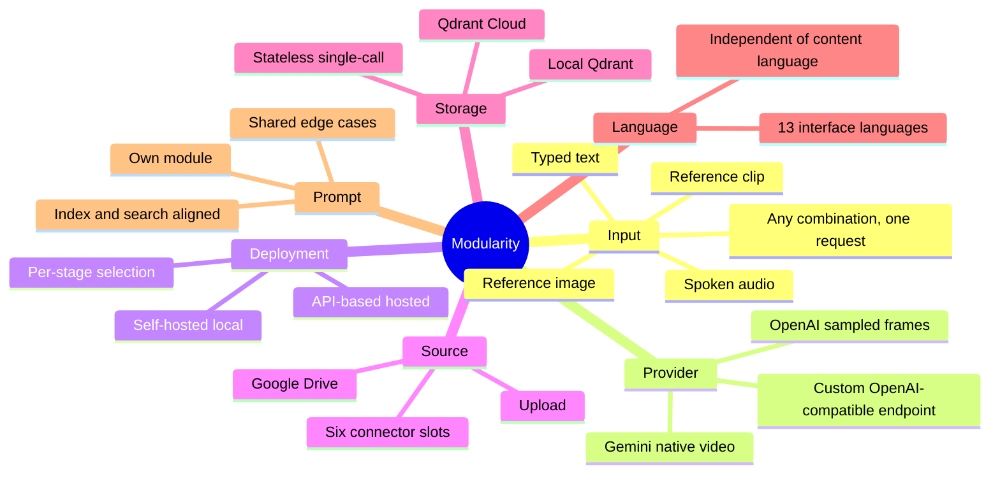
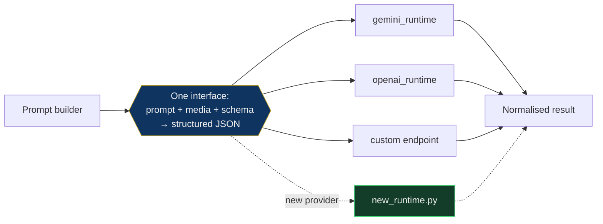
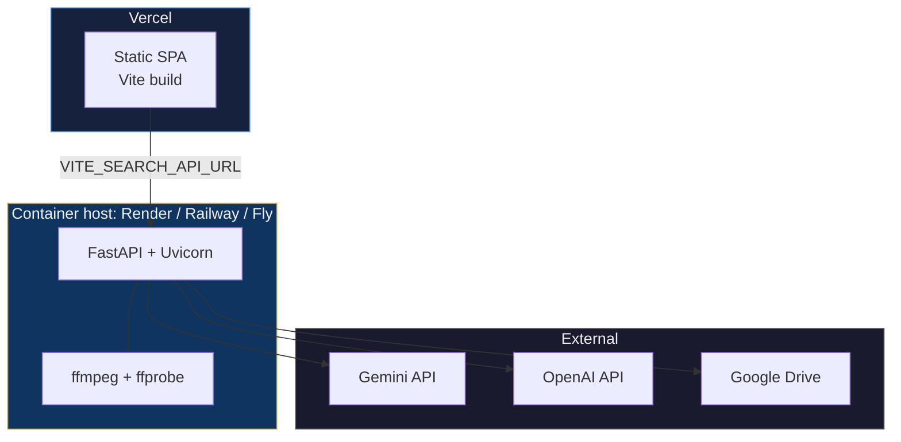
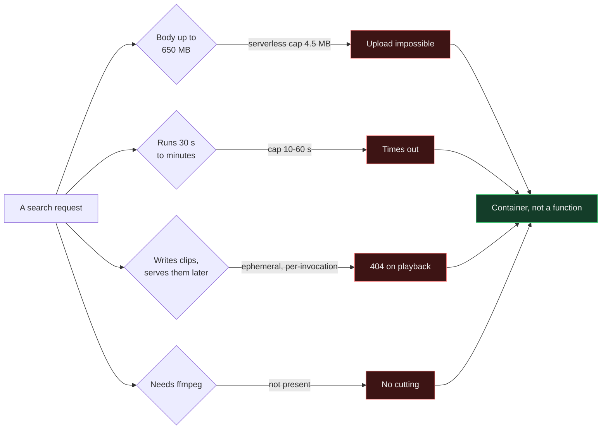

# Modularity and Deployment

## Seven independent axes

Every layer can be swapped without touching the others. Naming a layer and
having an answer for it is the point.

## Adding a provider is an adapter, not a rewrite

## Deployment topology

### Why the backend cannot be serverless

Any one of those four rules it out. The body limit and the ephemeral filesystem
are the fatal pair: a 4.5 MB cap makes video upload impossible, and `/tmp` is
not shared between invocations, so a clip written by one request would 404 when
the next request tried to serve it.
