# Engineering Process

## Purpose

This process keeps changes to a multimodal retrieval system reviewable. A
change can affect media handling, embedding compatibility, external data
disclosure, retrieval quality, UI understanding, and reproducibility at the
same time. The goal is not ceremony; it is a repeatable way to prove that a
change has a bounded scope and a visible effect.

## Delivery lifecycle

```mermaid
flowchart LR
  A[Define user outcome] --> B[Map affected profile and data contract]
  B --> C[Design the failure and privacy boundary]
  C --> D[Implement in a narrow module]
  D --> E[Unit and contract tests]
  E --> F[Manual workflow evidence]
  F --> G[Evaluate labelled retrieval if behaviour changed]
  G --> H[Update handbook and release notes]
  H --> I[Review and merge]
```

## Change classification

| Change type | Examples | Required review focus |
|---|---|---|
| UI-only | Copy, layout, client-side display state | Interaction clarity, keyboard behaviour, no secret/path leakage. |
| Pipeline | Windowing, media conversion, caption selection | Determinism, partial failure, cleanup, progress/diagnostic events. |
| Embedding contract | Model, dimensions, field names, collection | New/compatible profile, schema migration, reindexing, query compatibility. |
| Retrieval | Query expansion, RRF weights, merge limits | Ranked-list semantics, labelled metrics, no raw-score misuse. |
| Precision | Reranker or verification behaviour | Candidate bound, fresh relevance score, evidence/order boundary. |
| Provider/store | API, Qdrant configuration, model service | Consent, credentials, cost/access labels, retry/timeout behaviour. |
| Dependency | Package, model weights, system tool | Version/provenance, licence/security review, lock/notice impact. |

Any change may fall into several classes. The strictest applicable checklist
applies.

## Engineering standards

### Profile and schema discipline

1. Treat the embedding profile registry as a public contract.
2. Do not mix vectors from different models, tasks, or field definitions in
   one collection because their dimensions happen to match.
3. Add explicit profile metadata and collection selection for a new contract.
4. Reindex test data and update the Library/Search profile UI whenever a
   contract changes.
5. Preserve deterministic video/window/point identities unless a deliberate
   migration document explains the change.

### Retrieval and precision discipline

1. Keep independent named-vector search as the recall stage.
2. Use RRF to select candidates; do not pass RRF ranks, RRF scores, or raw
   similarity scores as cross-encoder features.
3. Rerank only the bounded top candidates with raw query plus candidate frames
   and available transcript/caption.
4. Verify/localise only a smaller final set and return evidence separately from
   ranking semantics.
5. When retrieval changes, evaluate with labelled relevant windows; never
   replace Recall@K/MRR/nDCG with model confidence.

### Security and privacy discipline

1. Keep browser state free of provider keys and filesystem paths.
2. Run external-media calls only after the profile's explicit consent check.
3. Redact secrets from job events, validation errors, exports, screenshots,
   fixtures, and documentation.
4. Use loopback-only local services by default; do not expose local Qdrant
   publicly without an explicit authentication/TLS deployment design.
5. Treat new remote persistence fields as data-disclosure changes. The
   current API-profile `source_path` payload is a documented hardening item,
   not an example to copy into new services.

### Reliability and observability discipline

1. Make stage transitions and model/provider readiness visible in structured
   diagnostics.
2. Ensure cancellation, missing audio, quota, network, unsupported media, and
   model-load failures have clear states.
3. Bound costly work: caption selection, top-K recall, reranker candidates,
   sampled frames, and verifier candidates.
4. Retry only safe remote/persistence operations and report retry count/time.
5. Do not disguise an unavailable optional stage as positive evidence.

## Test strategy

The test hierarchy is intentionally layered:

| Layer | Purpose | Typical scope |
|---|---|---|
| Unit | Prove pure behaviour cheaply | windowing, RRF, merge bounds, schema validation, redaction. |
| Contract | Check adapters and profile compatibility | Qdrant schema, runtime sessions, provider request/response handling. |
| Component | Validate client formatting/state decisions | frontend filter and UI helper tests. |
| Integration | Exercise real tool/model/Qdrant boundaries | marked tests requiring FFmpeg, models, test media, and Qdrant. |
| Acceptance | Prove a complete operator journey | configured local or Cloud profile, Library evidence, Search playback. |
| Evaluation | Measure retrieval changes with ground truth | labelled queries, relevant window IDs, Recall@K/MRR/nDCG. |

The authoritative scenarios and IDs live in the
[Acceptance test plan](acceptance-test-plan.md) and
[Acceptance test cases](acceptance-test-cases.md). Integration tests are not
implicitly portable: they need the documented executable, media, model, and
Qdrant prerequisites.

## Evidence package for a change

For a meaningful user-facing change, prepare a small review package:

| Evidence | Expected content |
|---|---|
| Scope statement | User outcome, profiles affected, explicit out-of-scope behaviour. |
| Contract notes | Changed fields, dimensions, collection/profile impact, migrations/reindexing. |
| Test record | Commands, environment/profile, pass/fail result, known skipped integration tests. |
| UI evidence | Screenshots or a short recording that shows setup, progress, result, and an expected failure state. |
| Retrieval evaluation | Label source, query set version, metrics at K, latency, and comparison baseline when retrieval changes. |
| Security review | Credential/data-flow impact and redaction/consent confirmation. |
| Documentation diff | Handbook/README updates for changed public behaviour. |

Do not paste raw API keys, customer footage, full provider payloads, or local
absolute paths into review evidence.

## Definition of done

A change is ready for review when all applicable items are true:

- [ ] The user outcome and profile boundaries are written down.
- [ ] Input validation, failure state, and diagnostic event are implemented.
- [ ] Unit/contract tests cover normal and relevant failure paths.
- [ ] Build/type/lint checks pass for affected components.
- [ ] No secrets, local media paths, or unredacted provider errors appear in
      browser/API output or fixtures.
- [ ] Profile/schema compatibility is proved, and a reindex plan exists if
      needed.
- [ ] Reranking and verification remain bounded; RRF is not reused as a model
      feature.
- [ ] Manual acceptance flow is recorded for changed UI/pipeline behaviour.
- [ ] Labelled metrics are captured when retrieval ranking changed.
- [ ] Handbook, dependency register, and acceptance cases reflect the change.

## Current operational constraints

The present system is a local, single-operator application. It intentionally
has one active indexing worker, an in-memory job registry/session store, local
job artifacts, and no tenant identity or durable queue. These constraints are
acceptable for controlled operation but must be explicitly revisited before a
multi-user or unattended deployment.

The first scale-up steps are durable job state, object storage/media locators,
authenticated access, a managed secret store, provider health monitoring, and
a versioned labelled evaluation suite. Treat those as future architecture work,
not as capabilities already provided by the current codebase.

## Documentation maintenance

| If this changes... | Update this page... |
|---|---|
| Profile/model/vector schema | [System architecture](../design/system-architecture.md) and [Data and retrieval design](../design/data-and-retrieval-design.md) |
| Operator route or error state | [Interaction design](../design/interaction-design.md) and acceptance cases |
| Package, provider, or tool | [Dependency register](../reference/dependency-register.md) |
| Startup/config/secrets posture | [Runtime configuration](../reference/runtime-configuration.md) |
| Quality acceptance criteria | Acceptance plan and cases |

Use the root README for concise first-run instructions; use the handbook for
design rationale and durable operational reference.
