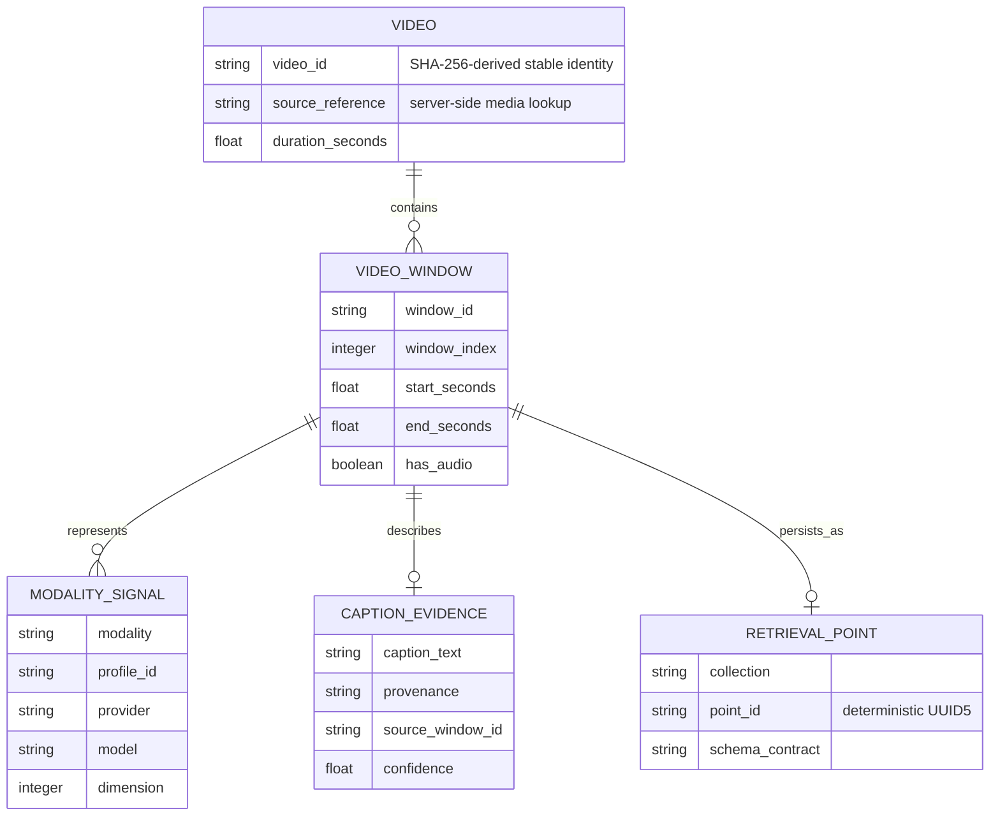
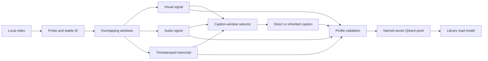
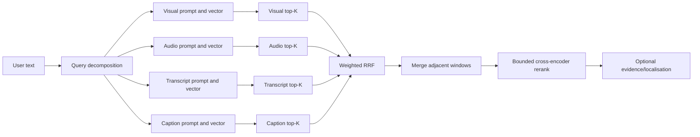

# Data and Retrieval Design

## Purpose

This page defines the data contracts that make multimodal search explainable
and safe to evolve. The core rule is simple: a video window can have several
representations, but each representation keeps its own embedding space and
its own retrieval path. The application never concatenates, averages, or
compares raw vectors from different encoders.

The current implementation uses Qdrant as the durable retrieval store. It is
not used as a relational system of record. Its point payload is intentionally
denormalized so a vector search can return the time interval, text evidence,
and provenance needed to render a result in one retrieval operation.

## Logical model



The diagram describes the logical relationships. Qdrant stores the window,
signals, text, and evidence together in one point payload rather than
performing database joins at query time. That is deliberate denormalisation
for a low-latency retrieval workload.

## Identity and temporal invariants

| Item | Rule | Why it matters |
|---|---|---|
| `video_id` | Derived from stable source content identity during probe | Gives a repeatable parent identity across processing attempts. |
| `window_id` | Deterministically combines the video identity and window ordinal | Keeps records addressable and prevents accidental duplicate logical windows. |
| Qdrant point ID | Deterministic UUID5 derived from `window_id` | A reprocess overwrites the same point instead of appending a duplicate. |
| Window bounds | `0 <= start < end <= video duration` | Keeps playback and localisation meaningful. |
| Window index | Ordered within a video | Supports adjacent-window merging and result timelines. |
| Embedding profile | Stored with every point and included in search filters | Prevents vectors from different model contracts being mixed. |

`processing_indexing/probe.py`, `windowing.py`, and the Pydantic contracts in
[`processing_indexing/models.py`](../../processing_indexing/models.py) enforce
these rules before persistence. A malformed interval, wrong vector dimension,
or non-finite value is a validation failure, not a best-effort upsert.

## Profile-specific vector schema

The profile registry is the compatibility boundary. A profile is more than a
model label: it fixes the field names, dimensions, default providers, target
collection, and query encoding strategy.

| Profile | Collection | Vector field | Dimension | Index-time source | Query-time source |
|---|---|---:|---:|---|---|
| `self-hosted-v1` | `video_windows` | `visual` | 512 | X-CLIP sampled frames | compatible local visual text encoder |
| `self-hosted-v1` | `video_windows` | `audio` | 512 | CLAP audio | compatible local audio text encoder |
| `self-hosted-v1` | `video_windows` | `speech` | 1024 | BGE-M3 transcript text | BGE-M3 query text |
| `self-hosted-v1` | `video_windows` | `caption` | 1024 | BGE-M3 generated caption text | BGE-M3 query text |
| `api-gemini-free-v1` | `video_windows_api_gemini_free_v1` | `visual` | 1536 | Gemini Embedding 2 video | Gemini Embedding 2 visual prompt |
| `api-gemini-free-v1` | `video_windows_api_gemini_free_v1` | `audio` | 1536 | Gemini Embedding 2 audio | Gemini Embedding 2 audio prompt |
| `api-gemini-free-v1` | `video_windows_api_gemini_free_v1` | `transcript` | 1536 | Gemini Embedding 2 transcript text | Gemini Embedding 2 transcript prompt |
| `api-gemini-free-v1` | `video_windows_api_gemini_free_v1` | `caption` | 1536 | Gemini Embedding 2 caption text | Gemini Embedding 2 caption prompt |

All fields use cosine-distance collections. The named-vector layout makes the
modality explicit in storage and avoids creating four disconnected vector
databases for one logical video window.

### Compatibility checks

Before an index or search operation, the runtime validates:

1. the selected profile exists;
2. the chosen provider and model are allowed by that profile;
3. the Qdrant collection has the expected named-vector schema;
4. every vector has the profile's expected dimension and finite numeric
   values; and
5. API-based searches filter on profile, provider, model, and dimension
   metadata as well as the named vector field.

This is why an apparent dimensional match is not enough to mix data. A vector
is meaningful only relative to its encoder and embedding task.

## Retrieval-point payload

Each point contains a compact retrieval payload in addition to named vectors.
The exact fields vary slightly by profile, but the payload is organised into
the following groups.

| Group | Typical fields | Purpose |
|---|---|---|
| Identity | `video_id`, `window_id`, `window_index` | Trace a result back to its video and deterministic point. |
| Time | `start_seconds`, `end_seconds`, `duration_seconds` | Build playback ranges and merge nearby results. |
| Evidence text | `transcript`, `caption` | Display evidence and provide context to the reranker/verifier. |
| Media state | `has_audio`, media metadata | Explain absent audio signals and pipeline behaviour. |
| Caption provenance | direct/inherited state, source window, confidence | Distinguish observed evidence from contextual carry-over. |
| Profile contract | profile, provider, model, vector dimensions | Enforce compatible retrieval and show an auditable result origin. |
| Operational metadata | selection reasons, change scores, VLM state | Make diagnostics and library inspection useful. |

### Missing-modality policy

Absence is represented deliberately:

- In the self-hosted profile, a silent or missing-audio window retains a
  zero-valued audio sentinel and `has_audio=false`. This preserves the fixed
  local schema while making the lack of acoustic evidence explicit.
- In the API-based profile, unavailable audio, transcript, or caption signals
  can be omitted. The cloud profile only requires a visual vector, avoiding a
  fabricated semantic embedding for content that was not available.
- A caption failure or selection skip is visible in provenance/diagnostics;
  it is never silently represented as a confident caption.

## Indexing: data lifecycle



The transcript is generated once for the full video or non-overlapping audio
chunks, then assigned to every overlapping window by timestamp. Captions are
selected from change signals instead of being generated for every window.
This reduces expensive vision-language calls while preserving provenance when
neighbouring contextual captions are inherited.

For API-based runs, unsupported inputs such as WebM are normalised into
provider-compatible video and audio clips using FFmpeg. Derived clips live
only in the job area and are cleaned up after processing.

## Query: compatible signals to ranked candidates



### 1. Query decomposition and encoding

The query is converted into four task-specific prompts: visual content, sound,
spoken/written transcript, and generated-description/caption. Each prompt is
encoded by the encoder compatible with that stored field. A text query can
therefore search a visual or audio embedding space only when that encoder was
trained to place the respective media and text forms in a shared space.

The application does not generate a generic text vector and compare it to an
arbitrary video vector. It generates a compatible vector for each named
channel, then keeps the resulting ranked lists separate until fusion.

### 2. Recall with weighted Reciprocal Rank Fusion

Each named-vector search returns its own ranked top-K list. Weighted RRF uses
the rank position from each list to create a candidate set:

```text
RRF(document) = sum over channels of weight(channel) / (RRF_K + rank(channel))
```

`RRF_K` is 60 in the current query configuration. RRF intentionally ignores
the raw similarity values because those scores are not calibrated across
different encoders. The system retains modality contributions as explanation,
not as an input to the next-stage model.

Adjacent or overlapping matches from the same video are then merged under
strict duration and source-window limits. This produces a useful playback span
without turning a cluster of hits into an unbounded clip.

### 3. Precision with a fresh multimodal score

The optional Qwen3-VL reranker sees only the raw query and the retrieved
candidate evidence: sampled frames, transcript, and caption. It returns a new
cross-encoder relevance score for the bounded candidate list. It does **not**
receive vector similarity, RRF rank, RRF score, modality contributions, or
VLM confidence as a feature.

This boundary is intentional:

- vector retrieval optimises recall cheaply across the library;
- cross-encoding optimises precision on a small set of rich candidates; and
- VLM verification/localisation supplies final human-readable evidence and a
  refined interval rather than another whole-library ranker.

The API profile and explicit local-Qwen route follow this strict boundary. The
retained legacy self-hosted verification route can blend verification and
retrieval confidence; it is documented as a compatibility limitation rather
than the target precision architecture.

## Privacy and retention implications

The application currently stores raw source media and job artifacts locally.
The browser does not receive source filesystem paths. API-based indexing sends
prepared media to the selected external providers only after explicit consent,
and keeps credentials in an in-memory backend session.

One current caveat is important: API-profile Qdrant payloads include a local
`source_path` string so the server can resolve playback. It is hidden from
browser responses, but it still travels to Qdrant Cloud. A privacy-sensitive
deployment should replace it with an opaque media reference and keep the
source-to-reference mapping in a protected local or authenticated metadata
service.

## Evolution rules

Use these rules when extending the data model:

1. Add a new model only through a new or explicitly compatible embedding
   profile; do not reuse a collection on the basis of equal vector dimension.
2. Add a new modality as a named vector plus explicit availability/provenance
   fields, not as an overloaded text field.
3. Keep raw vector fusion out of the pipeline unless a single jointly trained,
   calibrated embedding contract replaces the individual towers.
4. Version labelled evaluation queries with profile/model changes so
   Recall@K, MRR, and nDCG remain comparable.
5. Preserve deterministic identities and migration notes whenever the payload
   schema changes.

For system-wide sequencing, see [System architecture](system-architecture.md).
