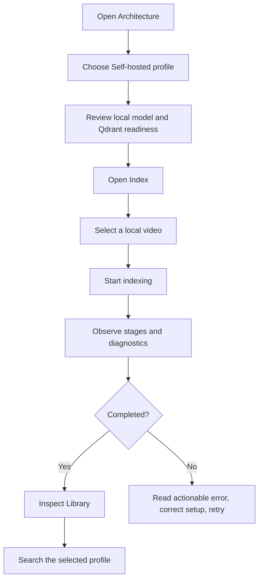
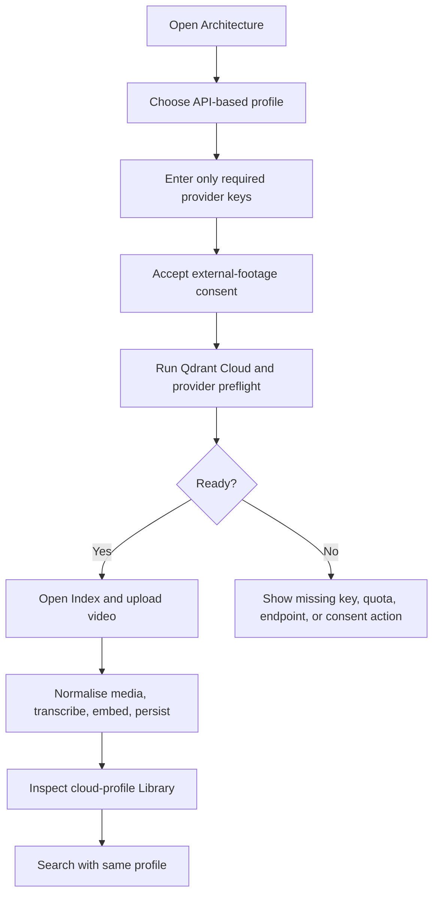
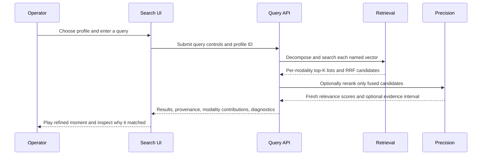

# Interaction Design

## Product intent

The interface makes a complex multimodal pipeline inspectable without asking
an operator to understand its source code. It should answer four questions at
every stage:

1. What profile and models will run?
2. What is happening now, and what is taking time?
3. What data was indexed and where is its evidence?
4. Why did a result appear and what exact moment should be played?

The browser is intentionally a local control surface. It never becomes the
owner of provider credentials, local source paths, Qdrant clients, or model
loading state.

## Information architecture

| Surface | Primary operator question | Main content | Decision enabled |
|---|---|---|---|
| Architecture | "What will this run use?" | Run profile, stage cards, provider/model controls, connection preflight, consent | Finalise a compatible configuration. |
| Index | "What am I about to process?" | Video upload, profile-specific options, readiness, preflight | Start a safe indexing job. |
| Processing job | "What is it doing?" | Stage progress, timing, counts, model state, structured diagnostics | Wait, retry after correction, or cancel safely. |
| Library | "What is already searchable?" | Indexed videos, profile tags, windows, vector presence, media access | Inspect coverage and choose a corpus/profile. |
| Window detail | "What evidence lives in this range?" | Playback, timestamps, transcript, caption/provenance, modality summaries | Validate a specific indexed window. |
| Search | "Where is the requested event?" | Profile selection, query, decomposition, reranking/verification controls, evidence | Retrieve, refine, and play the result. |

The global navigation follows this order because it mirrors the operator's
mental model: configure, index, inspect, then search.

## Primary flow: self-hosted processing

### Self-hosted interaction rules

- The visible profile label must match the effective collection and embedding
  contract. A local collection is never silently searched as a cloud profile.
- First-use model download and CPU/GPU loading are reported as progress rather
  than as a frozen page.
- Qdrant availability is shown before a long upload begins whenever possible.
- Cancellation stops the active job safely and preserves an interpretable job
  outcome; it is not presented as a successful partial index.

## Primary flow: API-based processing

### API-based interaction rules

- Each stage card makes its provider, model, cost/access label, and key
  requirement visible before a job is submitted.
- The UI must show an explicit consent notice before any selected video can be
  sent to an external provider.
- Keys entered into a block are transmitted to the local backend session once;
  the browser retains an opaque session identifier only. A restart invalidates
  those configured credentials.
- Preflight results distinguish invalid configuration from remote
  availability/quota. A green configuration state never promises that a free
  provider will accept an unlimited long-video run.

## Processing observability design

Long media processing cannot use a single indeterminate spinner. The job view
is structured as a live operational timeline.

| UI element | Meaning | Operator value |
|---|---|---|
| Job state and current stage | Queued/running/completed/failed/cancelled plus stage name | Establishes whether work is progressing. |
| Window progress | Current and total windows | Makes long-video scope concrete. |
| Stage counters | VLM selections, direct captions, Qdrant confirmations, calls saved | Explains pipeline choices and external-call volume. |
| Model readiness | checkpoint, device, cached/loading/failed state | Separates slow first use from a failed model. |
| Diagnostics feed | timestamped, redacted, structured events | Gives a useful error without exposing secrets. |
| Timing | elapsed job and stage timings | Supports cost/performance investigation. |

### Error treatment

Errors must describe the failing boundary and a next action, not simply echo a
stack trace. The expected message patterns are:

| Failure class | User-visible description | Next action |
|---|---|---|
| Missing local dependency | Required executable, model, or service is unavailable | Install/start the dependency or select API-based mode. |
| Local Qdrant unavailable | Qdrant cannot be reached or schema validation failed | Start Qdrant, confirm its port, then retry. |
| Provider configuration | Required key, Cloud URL, or consent is missing | Complete the relevant Architecture card. |
| Provider quota/network | Remote provider refused, throttled, or cannot be reached | Retry when available; review quota/status. |
| Unsupported/corrupt media | Probe or conversion cannot produce valid media | Use a supported video or inspect FFmpeg diagnostics. |
| Model failure | A local model failed to load or infer | Review model readiness; retry after resolving the device/cache issue. |
| Search has no matching result | Retrieval completed but evidence is insufficient | Reformulate the query, choose the correct profile, or inspect coverage. |

Raw secret values, file paths, and unfiltered provider responses are never
shown in these states.

## Library and evidence design

The Library is the proof that indexing occurred; it is not a generic file
browser. A video card should make the following immediately discoverable:

- indexed profile and provider/model contract;
- source duration and indexed window count;
- named-vector availability by modality;
- transcript/caption availability and caption provenance;
- indexed time ranges; and
- safe server-backed playback.

Window detail makes a caption's origin visible. A direct caption is frame
evidence for its own window; an inherited caption is context and must not be
presented as a direct observation. This distinction carries through to search
evidence.

## Search interaction design

### Result anatomy

Each result should include:

| Element | Interpretation |
|---|---|
| Video and time range | The candidate playback interval, with a refined 2-5 second span when localisation is available. |
| Profile badge | The exact embedding contract used for the search. |
| Modality contributions | Which visual, audio, transcript, or caption retrieval paths surfaced the candidate. |
| Transcript/caption | Search evidence, including caption provenance. |
| Reranker state | Whether the candidate received a fresh cross-encoder score or remained retrieval-only. |
| Verification evidence | Optional conditions, confirmations, contradictions, and localisation rationale. |
| Diagnostics | Provider/model selection, latency, unavailable stages, and evaluation state. |

RRF rank is used only to select candidates. The interaction must not present a
retrieval rank as though it were a reranker score or a verification confidence.

## Accessibility and responsive behaviour

The current Next.js interface uses semantic form controls and labelled
configuration fields as an engineering baseline. The acceptance suite includes
keyboard and screen-reader-oriented checks; accessibility conformance is not
claimed until those checks are executed against the rendered UI.

For narrow layouts, controls should remain in the same task order, tables must
retain labels or scroll affordances, and diagnostic details should be
expandable rather than hidden. High-density operational data should be
progressively disclosed: a concise status summary first, detailed structured
event data on demand.

## Design principles and non-goals

| Principle | Applied rule |
|---|---|
| Progressive disclosure | Show configuration summary and key job state first; place raw details behind expandable diagnostics. |
| Reversibility | Model/profile selection happens before a job; changing it later creates a separate compatible index rather than corrupting an existing one. |
| Honesty about uncertainty | Expose quota, download, remote-provider, and model-readiness states; never label an unverified result as confirmed. |
| Evidence before confidence | Surface modality evidence and provenance alongside any derived score. |
| Safe defaults | Keep keys off the browser's durable storage and keep self-hosted processing local by default. |

The UI does not attempt to be a multi-user administration console, permanent
secret manager, or cloud object-storage browser. Those needs require explicit
identity, retention, and tenancy design beyond this local application.

See [System architecture](system-architecture.md) for model boundaries and
[Acceptance test cases](../delivery/acceptance-test-cases.md) for testable
interaction outcomes.
