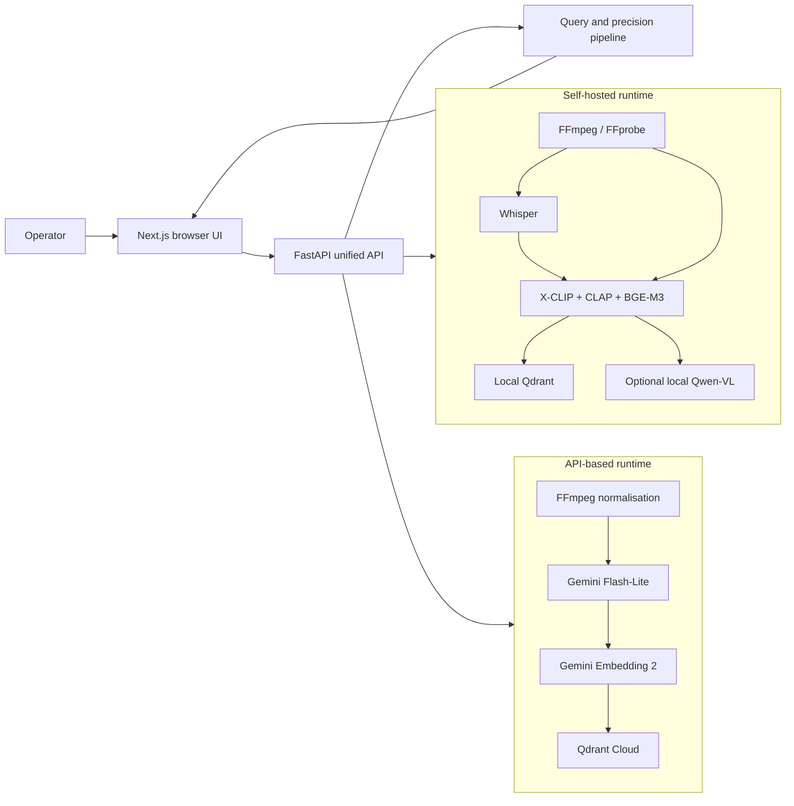
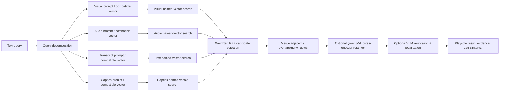

# System Architecture and Detailed Design

## Purpose and design goals

Video Search Workbench turns long-form video into time-bounded, explainable
search results. It deliberately separates **fast retrieval** from **expensive
precision work**:

1. Index video windows into independent visual, audio, transcript, and caption
   representations.
2. Search each compatible representation independently.
3. Fuse ranked lists only to choose a bounded candidate set.
4. Rerank and verify only that bounded set using raw multimodal evidence.

The design avoids a single averaged embedding because the local visual, audio,
and text models occupy different spaces. A text query is encoded by the text
tower or text encoder compatible with each indexed channel; channel lists are
then combined at the rank level, not at the raw-vector level.

## System context



The browser is a control and inspection surface. The FastAPI process owns
model orchestration, provider calls, job state, credential sessions, and
filesystem access. The browser receives a media endpoint keyed by window ID
rather than a server filesystem path. Browser responses deliberately omit the
server path; the API-based persistence payload currently includes that path in
Qdrant Cloud so the local server can resolve playback. That is a known
data-minimisation gap, documented in the privacy section below.

## Runtime profiles and compatibility contracts

The system has two explicit, non-interchangeable embedding profiles. A profile
fixes vector names, dimensions, collection name, default models, and storage
target. A collection is never shared across profiles merely because two
vectors happen to have the same dimension.

| Contract | Self-hosted | API-based (Gemini default) |
|---|---|---|
| Profile ID | `self-hosted-v1` | `api-gemini-free-v1` |
| Default window / stride | 10 s / 5 s | 20 s / 10 s |
| Vector store | Local Qdrant | Qdrant Cloud |
| Named vectors | `visual`, `audio`, `speech`, `caption` | `visual`, `audio`, `transcript`, `caption` |
| Dimensions | 512, 512, 1024, 1024 | 1536 for every named field |
| Default media/text stack | X-CLIP, CLAP, Whisper, BGE-M3 | Gemini Embedding 2 and Gemini Flash-Lite |
| Required credentials | None for the local default | Gemini and Qdrant Cloud credentials; explicit cloud-video consent |
| Optional precision stage | Local Qwen3-VL-Reranker-2B | Same local reranker, only after bounded recall |

The registry in
[`processing_indexing/runtime_profiles.py`](../../processing_indexing/runtime_profiles.py)
validates provider choices and rejects incompatible combinations before a job
or search is executed. API-based search currently supports the Gemini
embedding/decomposition path; OpenAI and NVIDIA selections are limited to the
implemented caption and verification boundaries rather than being presented as
interchangeable embedding profiles.

## Detailed indexing flow

```mermaid
sequenceDiagram
  participant B as Browser
  participant A as FastAPI / Job Manager
  participant M as Media and model pipeline
  participant V as Vector Store

  B->>A: Create job (file + public profile config)
  A->>A: Validate profile/session and redact diagnostics
  A->>M: Probe video and derive stable video ID
  M->>M: Create overlapping windows and timestamped transcript mapping
  M->>M: Produce independent visual, audio, transcript, caption signals
  M->>M: Select bounded caption windows; inherit marked context when safe
  M->>V: Validate schema and upsert deterministic window points
  V-->>A: Persisted records / schema result
  A-->>B: Progress, timings, safe diagnostics, library-ready state
```

### Ingestion and normalisation

1. The API accepts one local video upload and validates it with FFprobe.
2. `probe.py` extracts duration, streams, dimensions, codec, container, FPS,
   and audio availability. `stable_video_id` supplies the repeatable identity
   used by windows and Qdrant point IDs.
3. `windowing.py` derives clipped final windows from the configured length and
   stride. A window has a stable index, `[start, end]`, and `window_id`.
4. API-based runs use FFmpeg to make input media compatible with the selected
   provider when necessary (for example, WebM conversion or audio extraction).
   Self-hosted runs keep the local media path server-side.

### Independent indexing channels

| Channel | Self-hosted implementation | API-based implementation | Stored result |
|---|---|---|---|
| Visual | X-CLIP window encoder | Gemini Embedding 2 video input | `visual` vector |
| Audio | CLAP audio encoder; silent windows remain explicit | Gemini Embedding 2 audio input when audio is available | `audio` vector when present |
| Transcript | One timestamped Whisper pass; BGE-M3 encodes window text | Gemini Flash-Lite transcription, then Gemini Embedding 2 text | text plus `speech` or `transcript` vector |
| Caption | Selection-only metadata by default; optional local Qwen2.5-VL caption, then BGE-M3 text | Bounded Gemini captioning, or a selected OpenAI/Cosmos caption boundary, then Gemini Embedding 2 text | caption text, provenance, and `caption` vector |

All vector values are validated for expected dimension and finite numeric
values before persistence. A failed optional capability is recorded as an
explicit unavailable or failed state; it must not silently become positive
evidence.

### Caption selection and provenance

Captioning every window is deliberately avoided. The selector uses visual,
audio, and speech change signals to identify a bounded subset of windows for a
direct VLM call. Nearby context can be inherited only with provenance fields:
`caption_direct`, `caption_inherited`, `caption_source_window_id`, and
`caption_confidence`. Retrieval can discount inherited captions so a contextual
description is never confused with direct frame evidence.

### Persistence and job diagnostics

The local `QdrantStore` and profile-aware `ProfiledQdrantStore` validate the
live named-vector schema before writes. They use deterministic point IDs
derived from `window_id`, allowing reprocessing to overwrite the same logical
point rather than append duplicates. Upserts are batched and retryable.

The API returns structured job activity rather than raw provider responses.
The UI exposes current stage, window count, selection counts, VLM calls,
Qdrant confirmations, safe errors, timing, and model readiness. Sensitive
values are redacted before job configuration or diagnostics are returned.

## Detailed query and precision flow



### Recall: named-vector search plus RRF

- The query is expanded into modality-specific prompts. The self-hosted path
  uses local compatible encoders; the API profile uses Gemini to decompose and
  embed the query.
- Qdrant searches each named vector independently. API-profile retrieval also
  filters on embedding profile, provider, model, and dimension metadata.
- Reciprocal Rank Fusion (RRF) combines **ranks**, not raw incompatible vector
  scores. The default `RRF_K` is 60. Per-modality rank contributions are
  preserved as evidence.
- `merge_windows.py` joins temporally adjacent hits of the same video under
  bounded duration and window-count limits.

RRF is a **recall** stage only. Its score never becomes an input feature to the
cross-encoder.

### Precision: bounded multimodal reranking

When explicitly enabled, `Qwen3-VL-Reranker-2B` receives the raw text query,
sampled frames, transcript, and caption only for the fused top candidates. It
returns a fresh relevance score. The API profile and the explicit local-Qwen
precision path do not blend that score with an RRF score or a verification
confidence. Unavailable or partially scored candidates are represented in
diagnostics rather than silently treated as reranked.

### Evidence and temporal localisation

An optional VLM verification stage runs only after retrieval and, when enabled,
after reranking. It can use Gemini, OpenAI, or NVIDIA Cosmos according to the
selected runtime configuration. The verifier records satisfied conditions,
missing conditions, contradictions, evidence, and a bounded 2-5 second refined
interval. In the API profile and explicit local-Qwen precision path,
verification adds evidence and does not scan the library or redefine
cross-encoder ordering. The retained legacy self-hosted verification route can
blend normalized retrieval and VLM confidence; it is a compatibility path, not
the target precision contract, and should be retired before a uniform
production deployment.

### Quality metrics

For controlled labelled queries, the API can report Recall@K, MRR, and nDCG
for fused and precision-stage results. Ordinary live searches report these as
unevaluated when no relevant window IDs are supplied. This avoids inventing a
quality score from model confidence or vector similarity.

## Module boundaries and ownership

| Boundary | Responsibilities | Must not own |
|---|---|---|
| `processing_debug_frontend` | Architecture selection, file form, job/library/search views, client-safe state | API keys, source paths, Qdrant client logic |
| `processing_indexing.debug_api` | HTTP validation, job lifecycle, runtime-session endpoints, safe library media access | Model internals or browser persistence of secrets |
| `processing_indexing` pipeline modules | Probe, windowing, local embeddings, transcription, selector, captions, schema-safe storage | UI rendering or hosted-session persistence |
| `processing_indexing.api_pipeline` | Gemini media preparation, calls, profile-compatible records, safe events | Local model contract mutation |
| `query_retrieval` | Compatible query encoding, RRF, temporal merge, precision, verification, metrics | Index-time provider key storage |
| Qdrant | Named vectors plus safe window payload | Credential session state, raw source-video access |

Dependencies point toward concrete infrastructure at the boundary: domain
records are Pydantic/dataclass contracts, while Qdrant and hosted providers are
called through narrow adapters. This keeps model/provider failures diagnosable
without pretending the application is a distributed microservice system.

## Security and privacy design

| Control | Design response |
|---|---|
| API-key handling | Keys are submitted once to a backend runtime session. The browser stores only an opaque session ID; the session is process-local and expires after a bounded TTL. |
| Persistence | Key values are excluded from public responses, job history, exports, diagnostics, and browser storage. Backend restart clears the session store. |
| Footage disclosure | API-based mode requires explicit consent before video is sent to external providers. Self-hosted mode keeps processing local except for a deliberately selected hosted VLM. |
| Media path exposure | The UI reads media through a window-ID endpoint and browser responses omit source paths. API-based Qdrant payloads currently include a server path string for playback resolution; replace it with an opaque media locator before a privacy-sensitive deployment. |
| Profile isolation | Collection name, named-vector schema, and API payload filters prevent vectors from incompatible contracts entering a search. |
| Validation | Pydantic models validate timestamps and finite vector values; runtime setup rejects unknown public configuration fields to reduce accidental secret leakage. |
| Diagnostics | Provider errors are redacted and condensed before browser display. |

These controls reduce accidental disclosure in the current single-process
development architecture. They are not a substitute for an identity provider,
tenant isolation, encrypted object storage, or an audited secret manager in a
multi-user deployment.

## Scalability, reliability, and deliberate trade-offs

### Current right-sized deployment

The current setup is a local browser UI, one FastAPI process, local or managed
Qdrant, and on-demand local models. It optimizes for inspectability and
controlled demonstrations:

- Job state and API credentials are intentionally in process memory.
- Local model loading can be sequenced with `QUERY_LOW_MEMORY_MODE` to reduce
  laptop memory pressure.
- Qdrant writes use batches and deterministic IDs.
- Reranking and verification are bounded to avoid an O(library-size) multimodal
  pass.

### Scale-up path (not currently claimed as deployed)

| Observed pressure | Next boundary to introduce | Reason |
|---|---|---|
| Multiple concurrent long uploads | Durable job queue plus worker processes | Isolate CPU/GPU work from the HTTP server and make retries resumable. |
| Large source-video corpus | Object storage and a metadata catalog | Keep media lifecycle independent of Qdrant payloads. |
| Multiple operators/tenants | Authenticated identity, tenant filters, secret manager | Make access and credential isolation explicit. |
| Higher vector volume | Qdrant Cloud sizing/sharding and monitored capacity | Preserve named-vector search while moving storage operations off the laptop. |
| Evaluation at scale | Versioned labelled query set and CI benchmark job | Track Recall@K/MRR/nDCG across model/profile changes. |

## Design decisions and rationale

| Decision | Why | Consequence |
|---|---|---|
| Keep four named vector fields | Preserves modality-specific retrieval semantics and evidence | Requires profile/schema discipline and four recall queries. |
| Fuse ranks, not embeddings | Avoids comparing raw scores across incompatible encoders | RRF is a candidate selector, not a calibrated relevance score. |
| Rerank only top candidates | Gives multimodal precision without scanning all video | Reranker quality depends on recall retaining the correct window. |
| Separate profiles/collections | Prevents silent vector-dimension/model mixing | Reindexing is needed to move an asset across contracts. |
| Store caption provenance | Prevents contextual captions being presented as direct visual proof | Consumers must respect the provenance fields. |
| Ephemeral provider sessions | Limits key persistence and accidental diagnostics leakage | Backend restart invalidates a configured cloud session. |

## Implementation status checklist

- [x] Self-hosted four-channel indexing and retrieval contract.
- [x] API-based Gemini/Qdrant Cloud profile contract and profile-aware storage.
- [x] Browser architecture, indexing, library, and search views.
- [x] RRF recall, temporal merging, bounded local Qwen reranker option, and
  optional verification/localisation interfaces.
- [x] Structured diagnostics and labelled-query metric support.
- [ ] Durable jobs, tenant identity, durable credential management, and
  multi-worker orchestration ? intentionally outside the present local design.

For the exact field-level storage contract, continue to
[Data and retrieval design](data-and-retrieval-design.md). For concrete user
journeys, continue to [Interaction design](interaction-design.md).
